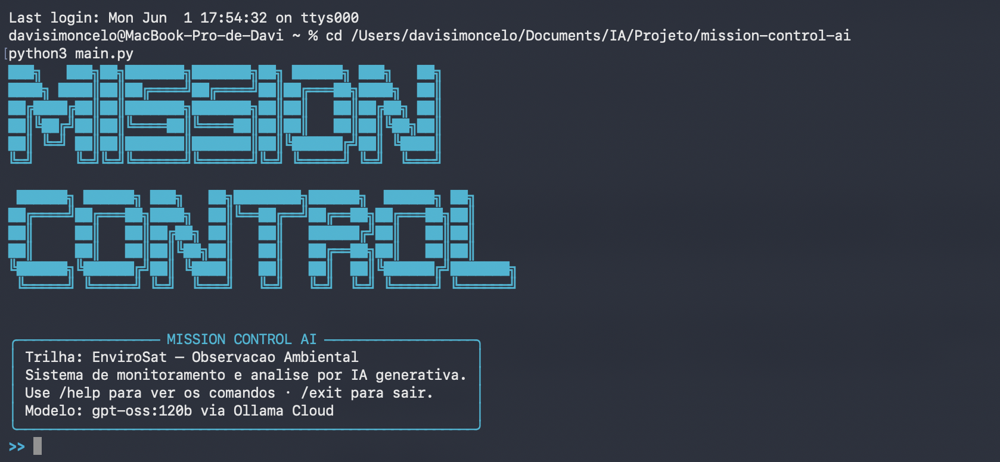
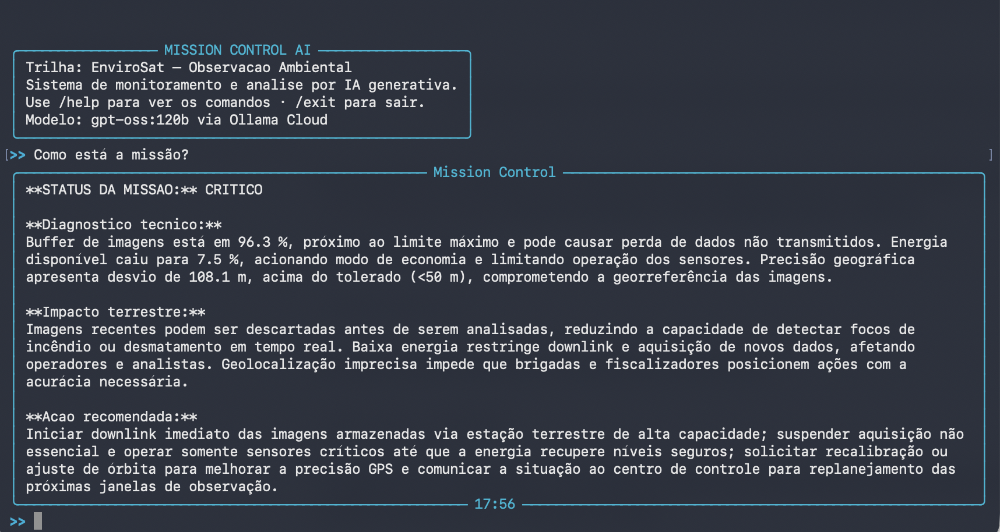

# Mission Control AI — EnviroSat

## Integrantes

- Nome Completo — RM: XXXXXX — Turma: XCCXX

## O que o projeto faz

Sistema de monitoramento do satelite EnviroSat-1 que simula telemetria de um satelite de observacao ambiental, detecta anomalias via thresholds em Python e analisa o estado da missao em linguagem natural usando IA generativa (Ollama Cloud). Cada alerta traduz a anomalia tecnica em impacto concreto para operadores, brigadas de incendio e analistas ambientais.

## Persona atendida

Operador do Centro de Controle Ambiental (INPE / orgao estadual): precisa de diagnostico rapido e acao clara diante de anomalias que podem indicar focos de incendio ou desmatamento.

## Tecnologias utilizadas

- Python 3.10+
- Ollama Cloud API (modelo gpt-oss:120b)
- rich 13.9.4
- prompt-toolkit 3.0.52
- pyfiglet 1.0.4
- python-dotenv 1.2.2

## Como executar

```
git clone https://github.com/usuario/mission-control-ai
cd mission-control-ai
python -m venv .venv
source .venv/bin/activate
pip install -r requirements.txt
# edite o arquivo .env e coloque sua chave Ollama
python main.py
```

## Comandos da CLI

- /status  — snapshot da telemetria atual com alertas
- /help    — lista os comandos
- /about   — informacoes sobre a missao
- /clear   — limpa o terminal
- /exit    — encerra o sistema
- qualquer texto — enviado a IA para analise contextualizada

## Demonstracao

(adicionar prints reais em assets/ apos rodar o sistema)




## System Prompt

Disponivel em prompts/system_prompt.md. Instrui o modelo a sempre conectar diagnostico tecnico com impacto terrestre, usando formato estruturado com classificacao de severidade.

## Cenarios de teste

1. Operacao normal — todos os parametros dentro do range
2. Foco de incendio critico — temperatura acima de 70C + NDVI baixo
3. Energia critica — abaixo de 20%, modo economia ativado pelo codigo Python
4. Multiplos alertas — buffer cheio + energia baixa + temperatura elevada simultaneos

## Proposta de valor / modelo de negocio

**Problema terrestre:** O Brasil perde milhoes de hectares de floresta anualmente para desmatamento e incendios. O gargalo nao e a falta de satelites — e o tempo entre deteccao do dado bruto e a resposta em campo. Operadores precisam interpretar telemetria tecnica e transformar isso em acao rapida, sem depender de especialistas disponiveis 24h.

**Quem paga:** Modelo hibrido — setor publico (INPE, IBAMA, Secretarias Estaduais de Meio Ambiente) financia a infraestrutura de monitoramento; setor privado (seguradoras rurais, empresas com metas ESG, operadoras de credito de carbono) paga por relatorios de compliance e certificacao de areas monitoradas.

**Metrica de impacto:** EnviroSat-1 operando 100% saudavel por 1 ano cobre cerca de 2 milhoes de hectares de areas protegidas na Amazonia Legal, reduz o tempo medio de resposta de brigadas de 6h para 4h, e gera 12 relatorios mensais de conformidade ambiental para orgaos reguladores.

**Modelo de negocio:** Dado-como-servico (DaaS). Orgaos ambientais assinam acesso a plataforma de alertas em tempo real. Analistas de compliance adquirem relatorios georeferenciados por area. Brigadas recebem notificacoes via API integrada ao sistema de despacho.

## Limitacoes conhecidas

- Telemetria e simulada aleatoriamente, nao reflete dados reais de satelite
- Sem persistencia de historico entre sessoes
- Interface apenas via terminal

## Video de demonstracao

https://www.youtube.com/watch?v=SEU_ID_AQUI

Configurado como "Nao listado" no YouTube.
